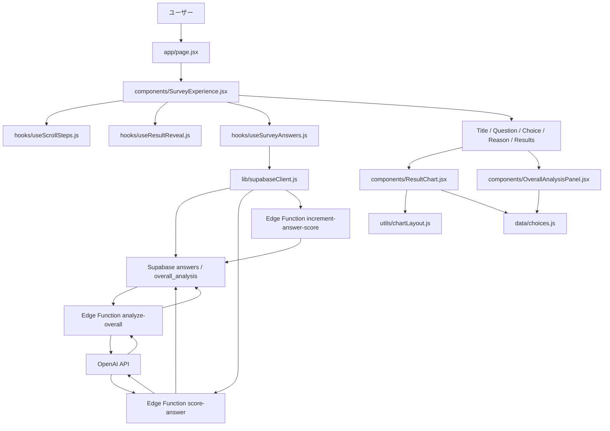
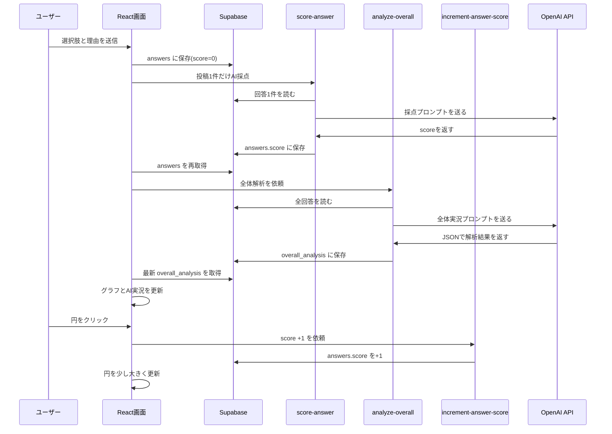

# Next.js App Router 版 ファイル構成の地図

このドキュメントは、静的な `index.html` / `styles.css` / `script.js` から、React と Next.js App Router に移行した後の読み方メモです。

## 全体像



## 入口

### `app/layout.jsx`

Next.js App Router の全ページ共通レイアウトです。  
HTML の `<html lang="ja">` や `<body>`、全体CSSの読み込みを担当します。

### `app/page.jsx`

トップページ本体です。  
ここには細かい処理を書かず、`SurveyExperience` を呼び出すだけにしています。

初心者向けポイント:

- `page.jsx` に全部書くと巨大化しやすいです。
- Next.js App Router では、`app/page.jsx` が `/` の画面になります。

## 画面全体の司令塔

### `components/SurveyExperience.jsx`

アンケート体験全体をまとめるコンポーネントです。

担当:

- 現在選んでいる回答を `state` で持つ
- 理由入力欄の文字を `state` で持つ
- 各スライドを並べる
- 回答送信後に結果ページへスクロールする
- hooks から受け取ったデータを各コンポーネントへ渡す

React概念:

- `useState`: 選択肢や入力中の理由など、画面の状態を覚える
- `props`: 親から子コンポーネントへデータや関数を渡す
- `event.preventDefault()`: フォーム送信でページ全体が再読み込みされるのを防ぐ

## hooks

### `hooks/useSurveyAnswers.js`

回答保存、回答一覧取得、全体AI解析の呼び出しを担当します。

担当:

- Supabase に回答を保存
- 投稿直後に `score-answer` を呼び、1件だけAI採点する
- 円クリック時に `increment-answer-score` を呼び、OpenAIなしで `score` を+1する
- Supabase から回答一覧を取得
- `analyze-overall` Edge Function を呼び出す
- 最新の `overall_analysis` を取得
- Supabase未設定時は `localStorage` に保存する

注意:

- フロントエンドから OpenAI API は直接呼びません。
- OpenAI APIキーは Supabase Edge Function の環境変数に置きます。
- ブラウザに置いてよいのは Supabase の anon key だけです。

### `hooks/useScrollSteps.js`

スクロール中に「今どのページを見ているか」を判定します。

担当:

- `IntersectionObserver` で表示中のスライドを検出
- 右側の進行ドットを更新
- 指定したスライドへスクロールする関数を提供

Scrollama との関係:

- まず動く最小構成として、ブラウザ標準の `IntersectionObserver` で再現しています。
- Scrollamaを戻したい場合も、このhookの中だけを差し替えると影響範囲が小さくなります。

### `hooks/useResultReveal.js`

結果ページ内で、グラフだけの表示からAI解析付き表示へ切り替えます。

担当:

- 結果ページに入った直後はグラフだけ表示
- さらに下へスクロールすると、ページ遷移せず同じ画面内でAI解析を表示
- 上へスクロールすると解析表示を閉じる

## components

### `components/TitleSlide.jsx`

最初のタイトル画面です。

### `components/QuestionSlide.jsx`

問いを見せる画面です。

### `components/ChoiceSlide.jsx`

選択肢ボタンを表示します。

React概念:

- `choices.map(...)` で配列から複数のボタンを作ります。
- 選択済みのカードだけCSSクラスを追加しています。

### `components/ReasonSlide.jsx`

理由入力フォームです。

React概念:

- `textarea` の `value` を `state` とつなぐと、Reactが入力内容を管理できます。
- `onChange` で入力のたびに `state` を更新します。

### `components/ResultsSlide.jsx`

結果ページ全体です。  
グラフとAI解析パネルを組み合わせます。

### `components/ResultChart.jsx`

D3/SVG描画のReact版です。

担当:

- 回答を点として表示
- AIスコアに応じて点の濃さと大きさを変える
- 円をクリックすると「いいね」として `answers.score` が+1される
- それぞれの選択肢ごとに、円形パッキング風のまとまりとして配置
- 高スコアの回答ほど中心へ、低スコアの回答ほど外側へ置く
- 円をホバーまたはフォーカスすると、即時ツールチップで回答理由を表示

D3の使い方:

- 今回はReactでSVG要素を描き、D3はスケール計算だけに使っています。
- ReactとD3を混ぜるときは、DOM操作をD3に任せすぎない方が管理しやすいです。

### `components/OverallAnalysisPanel.jsx`

AI解析結果の文章を表示します。

表示:

- 全体の傾向と考察を横幅いっぱいに大きく表示
- 考察メモ、光る意見、面白い意見を下段に並べる

## data / utils / lib

### `data/choices.js`

選択肢のIDと表示名を管理します。

重要:

- 内部データ名は `poopCurry` / `curryPoop`
- 画面表示は `うんこ味のカレー` / `カレー味のうんこ`

### `utils/chartLayout.js`

グラフ上の点の位置と、スコアによる見た目を計算します。

### `lib/supabaseClient.js`

Supabaseクライアントを作ります。

環境変数:

```env
NEXT_PUBLIC_SUPABASE_URL=...
NEXT_PUBLIC_SUPABASE_ANON_KEY=...
```

注意:

- `NEXT_PUBLIC_` が付いた値はブラウザに見えます。
- OpenAI APIキーは絶対にここへ書きません。

## CSS Modules

CSSは次のように分けています。

- `components/SurveyExperience.module.css`: スクロール、スライド共通、進行ドット、トースト
- `components/Slides.module.css`: タイトル、選択、理由入力など
- `components/Results.module.css`: 結果ページ、AI解析パネル
- `components/Chart.module.css`: SVGグラフ

CSS Modules の良いところ:

- クラス名が他のファイルと衝突しにくい
- コンポーネント単位で見た目を探しやすい

## データの流れ



## 今後編集するときの注意点

- 回答保存の処理を変えるなら `hooks/useSurveyAnswers.js`
- スクロール演出を変えるなら `hooks/useScrollSteps.js` または `hooks/useResultReveal.js`
- グラフの見た目を変えるなら `components/ResultChart.jsx` と `components/Chart.module.css`
- AI解析の文章やJSON形式を変えるなら `supabase/functions/analyze-overall/index.ts`
- 選択肢名を変えるなら `data/choices.js`

## 今後の拡張案

- Scrollamaを再導入して、ステップごとの演出をより細かく制御する
- `components/ResultChart.jsx` をさらに分けて、点、軸、ツールチップを別コンポーネント化する
- Supabase Edge Function のレスポンス型を TypeScript で定義する
- 投稿内容の moderation や NG ワード処理を Edge Function 側に追加する
- D3 の force layout を使って、点の重なりをより自然に散らす
