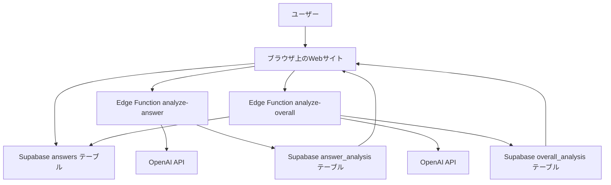
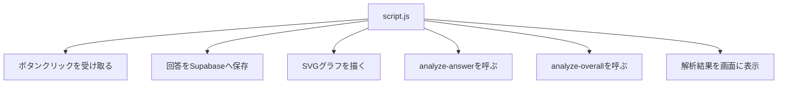
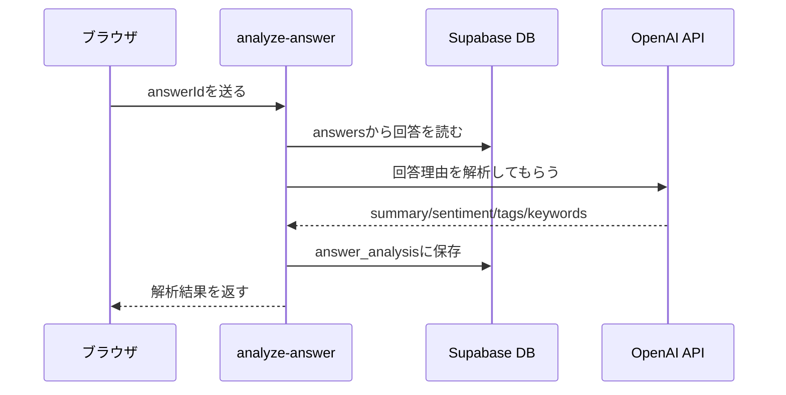
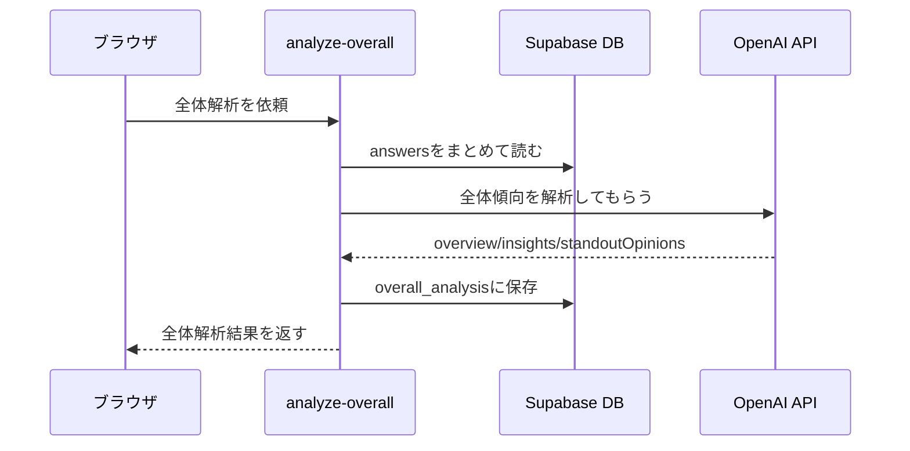
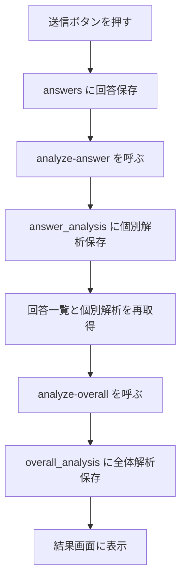
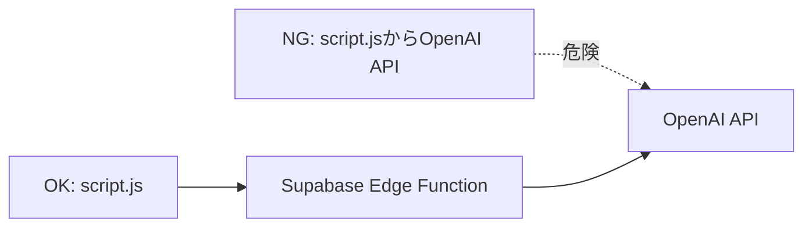

# プロジェクト全体の図解メモ

このドキュメントは、今のプロジェクトで「どのファイルが何をしているか」を見るための地図です。

## まず全体像

このサイトは、ざっくり言うと次の流れで動きます。



## フロントエンド側のファイル

フロントエンドとは、ユーザーのブラウザで動く部分です。

```text
index.html
styles.css
script.js
supabase-config.js
```

### index.html

画面に表示する部品を並べるファイルです。

ここには、次のような部品があります。

- タイトル画面
- 質問画面
- 選択肢ボタン
- 理由入力フォーム
- 結果グラフ
- 個別AI解析の表示欄
- 全体AI解析の表示欄

Reactで言うと、将来はこのHTMLのまとまりを `components` に分けていくイメージです。

### styles.css

見た目を決めるファイルです。

担当していることは次の通りです。

- 文字サイズ
- 色
- 余白
- スクロールスナップ
- 選択肢カードの見た目
- グラフの枠
- AI解析パネルの見た目
- スマホ表示の調整

HTMLが「骨組み」なら、CSSは「見た目」です。

### script.js

ブラウザ上の動きを担当するファイルです。

今のプロジェクトでは、かなり多くの仕事をしています。



初心者向けに言うと、`script.js` は「画面の司令塔」です。

ただし、今後React化するなら、この1ファイルは分割した方がよいです。

おすすめ分割:

```text
src/
├─ components/
│  ├─ ResultChart.jsx
│  ├─ AnswerAnalysisPanel.jsx
│  └─ OverallAnalysisPanel.jsx
├─ hooks/
│  ├─ useSurveyAnswers.js
│  └─ useScrollSteps.js
├─ lib/
│  └─ supabaseClient.js
└─ utils/
   └─ chartLayout.js
```

### supabase-config.js

ブラウザからSupabaseへ接続するための設定ファイルです。

ここに入れるもの:

- Supabase Project URL
- Supabase anon public key

ここに絶対に入れてはいけないもの:

- OpenAI APIキー
- Supabase service role key
- その他の秘密キー

`anon public key` はブラウザで使う前提の公開キーです。  
一方、`service role key` は強力すぎるので、Edge Functionだけで使います。

## Supabase SQLファイル

SQLファイルは、Supabaseのデータベースにテーブルやルールを作るためのものです。

```text
supabase/sql/
├─ 001_create_answer_analysis.sql
├─ 002_fix_answer_analysis_raw_analysis.sql
├─ 003_fix_answer_analysis_unique_answer_id.sql
└─ 004_create_overall_analysis.sql
```

### answers テーブル

これはあなたがSupabase上で先に作った回答保存テーブルです。

```sql
answers
├─ id
├─ choice
├─ reason
└─ created_at
```

役割:

ユーザーの回答そのものを保存します。

### answer_analysis テーブル

1件の回答に対するAI解析結果を保存します。

```sql
answer_analysis
├─ id
├─ answer_id
├─ summary
├─ sentiment
├─ tags
├─ keywords
├─ raw_analysis
└─ created_at
```

役割:

「この1件の回答はどういう意味か」を保存します。

例:

```json
{
  "summary": "見た目より味を重視している回答",
  "sentiment": "neutral",
  "tags": ["味覚", "現実性"],
  "keywords": ["味", "想像", "抵抗感"]
}
```

### overall_analysis テーブル

全回答をまとめたAI解析結果を保存します。

```sql
overall_analysis
├─ id
├─ total_count
├─ choice_counts
├─ leading_choice
├─ overview
├─ insights
├─ opinion_groups
├─ standout_opinions
├─ recommendations
└─ created_at
```

役割:

「全体としてどういう傾向があるか」を保存します。

例:

```json
{
  "total_count": 20,
  "leading_choice": "poopCurry",
  "overview": "全体として見た目より味を重視する意見が多い。",
  "insights": ["味覚重視派が多い", "少数派には倫理的な違和感がある"],
  "standout_opinions": [
    {
      "reason": "名前よりも食体験として想像できる方を選ぶ",
      "whyItStandsOut": "判断基準が具体的"
    }
  ]
}
```

## Edge Function

Edge Functionは、Supabase上で動く小さなサーバー処理です。

重要なのは、OpenAI APIキーをここに置くことです。

```text
supabase/functions/
├─ analyze-answer/
│  └─ index.ts
└─ analyze-overall/
   └─ index.ts
```

### analyze-answer

1件の回答を解析する関数です。



この関数で見るのは「1人の回答」です。

### analyze-overall

全回答をまとめて解析する関数です。



この関数で見るのは「全員の回答」です。

## OpenAI APIへのプロンプトはどこにあるか

OpenAI APIへのプロンプトは、Edge Functionの中にあります。

```text
supabase/functions/analyze-answer/index.ts
supabase/functions/analyze-overall/index.ts
```

フロントエンドの `script.js` にはOpenAI APIキーもプロンプトも置きません。

理由:

- APIキーを守るため
- AI解析の責務をサーバー側に分けるため
- 将来プロンプトを変えても画面側を壊しにくくするため

## 回答送信時の流れ

今の実装では、回答を送信すると次の順番で動きます。



## 役割の分け方

今の役割分担はこうです。

| 役割 | ファイル |
| --- | --- |
| 画面の骨組み | `index.html` |
| 見た目 | `styles.css` |
| ブラウザ上の操作 | `script.js` |
| Supabase接続設定 | `supabase-config.js` |
| 1件ごとのAI解析 | `supabase/functions/analyze-answer/index.ts` |
| 全体のAI解析 | `supabase/functions/analyze-overall/index.ts` |
| 1件解析の保存先 | `answer_analysis` |
| 全体解析の保存先 | `overall_analysis` |

## 今いちばん大事な理解

```text
script.js は OpenAI API を直接呼ばない
```

これが一番大事です。



OpenAI APIキーはEdge Functionの環境変数に置きます。

## 今後React化するときの考え方

今は `script.js` が大きくなっています。

React化するなら、次のように責務を分けると読みやすくなります。

```text
src/
├─ components/
│  ├─ QuestionSlide.jsx
│  ├─ ChoiceCards.jsx
│  ├─ ReasonForm.jsx
│  ├─ ResultChart.jsx
│  ├─ AnswerAnalysisPanel.jsx
│  └─ OverallAnalysisPanel.jsx
├─ hooks/
│  ├─ useSurveyAnswers.js
│  ├─ useAnswerAnalysis.js
│  └─ useOverallAnalysis.js
├─ lib/
│  └─ supabaseClient.js
└─ data/
   └─ choices.js
```

React初心者向けに言うと:

- component は画面の部品
- props は親から子へ渡す値
- state は画面の状態
- hooks は保存や取得などの処理をまとめる関数

今のプロジェクトは、React化する前のプロトタイプとして、かなり良い材料がそろってきています。

